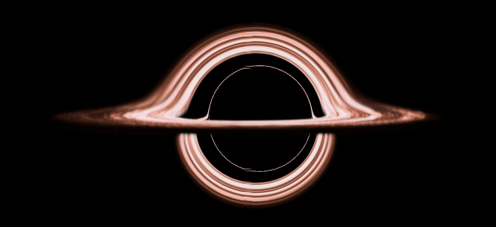

# Gargantuan-Belly — real-time Kerr and charged black holes in Vulkan

This project renders a cinematic, gravitationally lensed black hole and
accretion disk with Vulkan. Its physical model is based on:

> Oliver James, Eugénie von Tunzelmann, Paul Franklin, and Kip S. Thorne,
> “Gravitational Lensing by Spinning Black Holes in Astrophysics, and in the
> Movie *Interstellar*,” *Classical and Quantum Gravity* **32** (2015) 065001,
> [arXiv:1502.03808](https://arxiv.org/abs/1502.03808).

It is a real-time renderer inspired by DNGR, not a claim to reproduce Double
Negative's production code or assets. The default shot is visually calibrated
against the unshifted, unflared disk in the paper's Figure 15(a).

The project has one canonical implementation of each production metric and its
ray equations. Their Slang modules in `src/physics/slang/` compile to
double-precision host C++ for scientific tests and the physics probe, and to
float SPIR-V for the active Vulkan fragment pipeline. Renderer-only camera and
appearance modules are linked only into that fragment. See
[`docs/PHYSICS.md`](docs/PHYSICS.md) for the path followed by one rendered ray
and [`docs/ARCHITECTURE.md`](docs/ARCHITECTURE.md) for dependency boundaries
and the metric/theory extension workflow.



## What is implemented

- Strong Slang physics values for points, tangent vectors, covectors,
  covariant/contravariant rank-two tensors, and eight-dimensional canonical
  phase space.
- A horizon-penetrating Cartesian Kerr-Schild metric, explicit stationary-FIDO
  camera and chart transforms, the metric Hamiltonian
  `H = 1/2 g^(mu nu) p_mu p_nu`, exact factorized Kerr-Schild Hamilton
  equations, and fourth-order Runge–Kutta integration. Host science and Vulkan
  use the same `KerrSchildHamiltonianSystem` and `integrateCanonicalRk4()`
  source. `AutomaticCanonicalFlowSystem` supplies a reverse-mode automatic
  fallback for new theories and the scientific oracle for the optimized Kerr
  flow. The metric's shared domain predicate keeps the regular axis/horizons
  valid while rejecting its zero-radius branch disk and ring.
- A selectable Reissner–Nordström spacetime in horizon-penetrating Cartesian
  Kerr–Schild coordinates, with dimensionless charge `0 <= |Q|/M <= 0.998`, a
  stationary-observer camera, charged circular-orbit disk kinematics, and its
  own concrete SPIR-V fragment pipeline. Its exact factorized Hamiltonian flow
  is also shared by host science and Vulkan and tested against automatic
  differentiation. `Q = 0` reduces to Schwarzschild.
- Backward propagation of each render ray in Cartesian Kerr-Schild coordinates.
  Boyer–Lindquist coordinates are used to construct the paper-inspired observer
  and to recover a disk azimuth, but the active renderer has no
  Boyer–Lindquist pole switch or screen-space singularity reconstruction.
- A renderer-independent C++ scientific layer with chart-tagged points,
  vectors, covectors, variance-aware Eigen tensors, generic connections and
  curvature, and Boost.Numeric.Odeint integration policies. The canonical
  Slang metric and flow are exposed to that layer through typed host adapters.
- A host metric registry. Its `kerr-schild` and `reissner-nordstrom` entries use
  generated canonical Slang metrics; Minkowski, Schwarzschild, and
  Boyer–Lindquist Kerr remain C++ reference/validation models. Registering a
  host metric does not implicitly create a Vulkan pipeline.
- A thin volumetric, marginally optically thick disk whose procedural filament
  field drives both emission and extinction, following the approaches
  summarized in Appendix A.6.
- Long-running, radius-dependent disk advection. The Kerr shadow and lens map
  remain stationary because this shot uses a stationary, axisymmetric
  spacetime; the disk material is the part that visibly rotates. To keep
  differential rotation from winding a texture into unresolved subpixel
  spirals, each deterministic material realization has an eight-second local
  advection epoch and crossfades to its successor during the final two seconds.
  This bounds the accumulated shear while keeping the handoff continuous.
- A position-independent 4500 K source assumption and movie-style spin
  `a/M = 0.6`, following Sections 4.1–4.2. The default unshifted display uses
  copper, dusty-rose, blush, and pearl colours calibrated from Figure 15(a);
  the blackbody approximation is used when frequency shifts are enabled.
- Optional gravitational/Doppler frequency shifts for circular,
  positive-azimuth disk orbits, which are prograde when the black-hole spin is
  positive, and the `I_nu ∝ nu^3` intensity shift from Liouville's theorem.
  They are off by default because the paper explains that the movie omitted
  them.
- Luminance-preserving filmic tone mapping and an optional HDR celestial
  environment. Escaping geodesics sample the NASA Deep Star Maps OpenEXR, so
  its radiance is lensed by the black hole and transmitted through the disk;
  the near-black Figure 15(a) background remains the no-asset fallback.

The renderer intentionally does not integrate DNGR's geodesic-deviation beam
equations (A.18–A.38), elliptical weighted-average filtering, analytic motion
blur, measured IMAX point-spread function, or film spectral-sensitivity curves.
Those features made DNGR an offline 40,000-line renderer that took 30 minutes
to hours per 23-megapixel frame. Gargantua traces one central ray per render
pixel, uses heuristic RK4 step sizes, and adds deterministic output dithering so
it remains interactive. The camera is a stationary FIDO (`beta = 0`), and the
disk asset and shifted blackbody-to-RGB conversion are approximations.

## Requirements

- Linux x86-64 with a Vulkan 1.1-capable GPU and driver
- Bazel 9 (the project currently pins `rules_cc` 0.2.22 through Bzlmod)
- A C++17 compiler
- Vulkan development headers and loader
- GLFW 3 development files
- zlib development files (for 16-bit PNG output)

Install the optional 8K HDR sky map before building or running if you want the
celestial environment instead of the near-black fallback:

```bash
./scripts/download_sky_map.sh
```

The build downloads the checksum-pinned official Slang 2026.16 compiler. Slang
emits both active shader stages as SPIR-V 1.3 and emits portable C++ for host
tests; it is a build tool, not a runtime dependency. Normal builds do not need
`glslc`. Install it only to compile the explicitly named legacy GLSL vertex or
fragment oracle targets; those targets do not supply active Kerr equations.

On Ubuntu, the non-Bazel system packages are typically:

```sh
sudo apt install libvulkan-dev vulkan-tools libglfw3-dev zlib1g-dev
```

## Build and run

```sh
bazel build //:gargantua
bazel run //:gargantua
```

On an NVIDIA Optimus laptop, request the discrete NVIDIA Vulkan driver with:

```sh
bazel run --config=nvidia //:gargantua
```

The program prints `Using Vulkan device: ...` at startup; check that it names
the NVIDIA GPU. The preset enables standard PRIME/Optimus environment hints
and asks compatible Vulkan loaders to restrict driver discovery to NVIDIA,
without hard-coding a distribution-specific ICD path. On older loaders that
ignore this filter, the Optimus layer and Gargantua's discrete-device preference
still favour NVIDIA when it is visible.
The preset changes device selection only: it does not change the ray-quality
preset or disable the interactive FPS cap. The active ray integration already
runs in the Vulkan fragment shader on whichever physical device is printed.

Gargantua intentionally rejects devices that Vulkan classifies as CPU, such as
`llvmpipe`, instead of silently rendering at software speed. If no suitable
non-CPU Vulkan device is visible, startup fails with an actionable error.
Containers and remote sessions must expose a vendor or passed-through Vulkan
device and driver.

The first build downloads the pinned numerical, UI, and Slang dependencies.
Eigen and doctest come through Bzlmod; the official Boost source archive is
checksum pinned for its header-only Odeint library. Bazel invokes Slang and
produces both active SPIR-V stages; there is no manual shader-build step and no
texture asset to download.

The interactive controls use checksum-pinned Dear ImGui 1.92.9. Its GLFW and
Vulkan backends are built as a separate Bazel library; no UI code is mixed into
the canonical physics modules or active fragment pipeline.

### Controls

| Key | Effect |
|---|---|
| `Space` | Pause or resume disk motion |
| `R` | Restore the paper-inspired shot defaults |
| `D` | Toggle colour and `g^3` brightness shifts (roughly Figure 15(c)) |
| `F` | Toggle the configured FPS cap |
| `F1` | Show or hide the parameter menu |
| `U` | Show or hide this process's CPU/GPU statistics overlay |
| Arrow keys | Reframe the black hole in the virtual lens |
| `[` / `]` | Decrease or increase the selected metric's spin or charge |
| `-` / `=` | Decrease or increase exposure |
| `Esc` | Quit |

The in-window menu exposes a Kerr/Reissner–Nordström selector, spin or charge,
camera geometry and roll, disk dimensions and temperature, exposure,
relativistic shifts, animation state, an adjustable 5–60 FPS limit, and three
ray-integration quality presets. Changing spacetime rebuilds only the concrete
ray pipeline and preserves the rest of the scene.

### Windowless snapshot

The second target renders through Vulkan without a window or display server and
writes a 16-bit PNG or binary PPM from a linear RGBA16F target. It is useful for
reproducible stills, remote machines, and shader validation:

```sh
bazel build //:gargantua_headless
bazel run //:gargantua_headless -- "$PWD/gargantua.png" 1000 459 2
bazel run //:gargantua_headless -- "$PWD/rn.png" 1000 459 2 reissner-nordstrom 0.8
```

On an NVIDIA Optimus laptop, apply the same NVIDIA selection preset:

```sh
bazel run --config=nvidia //:gargantua_headless -- "$PWD/gargantua.png" 1000 459 2
```

The output path, width, height, supersampling factor, spacetime, and active
metric parameter are optional. The spacetime is `kerr` or
`reissner-nordstrom` (also `rn`); its final value is spin or charge. Defaults
are `gargantua.ppm`, 1000, 459, 1, Kerr, and `a/M = 0.6`. RN defaults to
`Q/M = 0.8` when selected without a charge. Supersampling accepts factors from
1 to 8.

### Tests and host probe

```sh
bazel test //:tests
bazel run //:gargantua_physics_probe -- kerr-schild
```

The suite checks the generated double-precision Slang metrics and checks the
exact factorized Kerr and Reissner–Nordström flows against their scalar
Hamiltonians and reverse-mode automatic references. It also covers the
uncharged Schwarzschild limit, tensor variance, connections and curvature,
Hamiltonian invariants, adaptive integration, scene behaviour, 16-bit output,
and the reflected 64-byte C++/Slang push-constant contract. The active SPIR-V
fragment is compiled as an input to the shader-interface test. A compile-only
SPIR-V fixture also instantiates the quartic-dispersion theory through the
reverse-mode automatic fallback on the GPU target.

The probe is a pure host program. Its default `kerr-schild` selection goes
through the registry to the generated Slang metric, then feeds the resulting
metric jet to the C++ Eigen curvature algorithms. If
`VK_LAYER_KHRONOS_validation` is installed, both Vulkan front ends discover and
enable it automatically and report warnings through the debug messenger.

## Performance and tuning

The full-quality fragment permits up to 360 shared `integrateCanonicalRk4()`
steps per pixel. The interactive Vulkan pipeline specializes it to 140, 220,
or 300 steps with a matching step scale for the Performance, Balanced, and
High presets. The headless renderer uses the unspecialized 360-step defaults.
Rays that reach the horizon, escape to the far-field background, or become
opaque in the disk terminate early.

The production Kerr flow uses exact algebraic factorization rather than
differentiating the scalar Hamiltonian separately along all eight phase-space
axes. The previous forward-mode path therefore performed 32 differentiated
Hamiltonian/metric evaluations in each four-stage RK4 step. The specialized
flow removes that work; the generic reverse-mode path remains available for
new theories and as an independent scientific oracle.

In controlled 1000×459 windowless traces on the development RTX 4050 Laptop
GPU, the draw-and-readback fence interval fell from 89.50 ms to roughly
21–22 ms, about a 75% reduction for that workload. The physics-flow change
reduced the fragment SPIR-V from 104,504 to 40,940 bytes; the current fragment,
including bounded material renewal, is 51,544 bytes. Outside a renewal fade it
measured 21.01 ms, and during the final two-second fade it measured 21.99 ms.
That is about 4.7% temporary overhead and roughly 1.2% weighted over a complete
material epoch. These are comparative profiling numbers, not a promised
application FPS: interactive resolution, ray preset, early termination,
presentation, the FPS cap, driver, and laptop power/clock state all affect
observed frame rate.

The interactive renderer uses two frames in flight and defaults to a 15 FPS
cap. The Performance menu exposes both the enable switch and a 5–60 FPS slider;
`F` toggles the currently configured value. The initial window is 2000×1100;
when diagnosing a low frame rate, disable the cap, select Performance, and
resize the window so those variables are explicit. Fragment work scales roughly
with pixel count. Headless supersampling cost and image memory scale
approximately with the square of the selected factor, so 2 is the recommended
quality setting and 4 is intended for final stills.

The renderer-independent default shot lives in `figure15aScene()` in
`src/scene/presets.cpp`:

- camera radius `74.1 M`, inclination `86.56°`, vertical FOV `30°`;
- black-hole spin `a/M = 0.6`;
- procedural emitting disk radii `6 M` to `18.7 M`, temperature `4500 K`;
- horizontal lens shift `0`, vertical framing shift `0.045`, exposure `1.15`;
- frequency shifts disabled.

The paper states an inner radius of `9.26 M` for Figure 15(a). This real-time
central-ray approximation uses a `6 M` emitting edge because it reproduces the
published thickness of the upper and lower disk images more closely without
DNGR's ray-bundle footprint and proprietary artist-authored disk asset. Set
`scene.disk.innerRadius` to `9.26f` in `figure15aScene()` for the literal paper
radius.

`src/rendering/gpu_parameters.*` is the only scene-to-GPU conversion. It packs
the domain scene and per-frame values into the exact 64-byte
`GpuRenderParameters` transfer object mirrored by `RenderParameters` in
`shaders/black_hole.slang`. Static C++ layout assertions and Slang reflection
protect that ABI.

## Code map

- `src/physics/slang/` is the canonical, cross-target physics engine.
  `KerrSchild*.slang` and `ReissnerNordstrom*.slang` own the two production
  metrics, optimized flows, and camera/chart transforms; the remaining core
  modules own shared types, Hamiltonians, the flow interface, and RK4.
- `src/physics/canonical_engine.*` and
  `src/physics/dynamics/canonical_systems.*` are thin typed C++ adapters over
  generated double-precision Slang exports.
- The remaining C++ files in `src/physics/` supply Eigen tensor/curvature
  analysis, Boost.Odeint policies, registries, and validation models. They do
  not define the active renderer's production equations.
- `shaders/black_hole.slang` supplies separate Kerr and
  Reissner–Nordström fragment entries over shared ray termination, disk
  transfer, palette, and tone mapping.
- `shaders/fullscreen.slang` is the active fullscreen vertex entry, and
  `shaders/quartic_dispersion_probe.slang` is a compile-only GPU fixture for the
  non-metric theory interface.
- `shaders/black_hole.frag` and the GLSL files below `shaders/physics/` and
  `shaders/appearance/` are retained as legacy visual/validation oracles. They
  are not loaded by either executable.
- `src/scene/` owns domain state and presets;
  `src/rendering/gpu_parameters.*` alone packs that state into the shader ABI.
- `src/app/`, `src/rendering/`, and `src/tools/ui/` own application, Vulkan,
  and Dear ImGui concerns. Physics targets have no dependency on them.

## Project layout

```text
BUILD.bazel                       Executables, adapters, tests, shader runfiles
src/physics/slang/                Canonical cross-target physics modules
src/physics/canonical_engine.*    Generated-host ABI wrapper
src/physics/dynamics/             Typed host systems and integration policies
src/physics/metrics/              Canonical adapter plus C++ reference metrics
src/scene/                        Renderer-independent scene and presets
src/app/                          Window lifecycle, controls, swapchain, frames
src/rendering/                    GPU adapter, Vulkan pipeline, offscreen path
src/tools/ui/                     Dear ImGui controls and presentation styling
src/io/                           Linear-light 16-bit PNG/PPM encoding
src/tools/                        Physics probe and still-renderer entry points
shaders/black_hole.slang          Active fragment/render integration pipeline
shaders/fullscreen.slang          Active fullscreen vertex shader
shaders/quartic_dispersion_probe.slang  GPU compile fixture for theory extension
shaders/**/*.glsl                 Legacy fragment and visual reference modules
tests/                            Physics, domain, GPU-contract, and I/O tests
tools/slang/                      Hermetic Bazel rules for Slang compilation
third_party/                      Bazel definitions for pinned external sources
```
